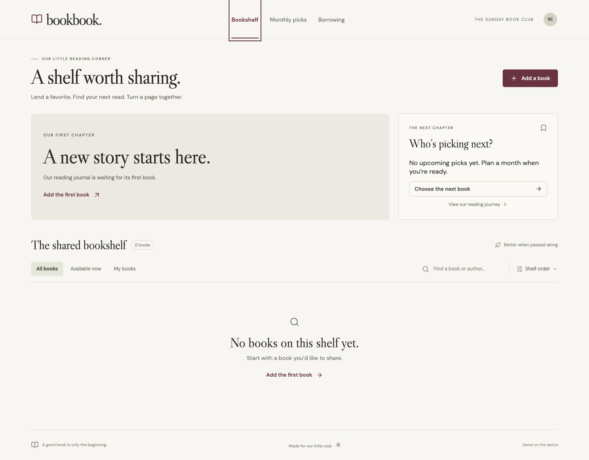

# Bookbook

A responsive book-club app with dimensional book covers, a shared lending shelf, monthly reading history, an editable chooser rotation, and a small Kakao book-search backend.



## Run

```sh
npm install
npm run dev
```

Open the local URL printed by Vite. `npm run dev` serves the frontend and all `/api/*` endpoints. Production build: `npm run build`. Logic checks: `npm test`. `npm run preview` previews static assets only; use the dev server or Vercel for book search.

## Invite-only member accounts

Joining takes a unique name, a password (12–128 characters), and the club code. Later logins use name and password only. Korean names are supported; names are case-insensitive and must be 2–30 characters after normalization. No email or social login is required.

### One-time database setup

1. Create a hosted PostgreSQL database (for example, [Neon](https://neon.com/)) and copy its pooled connection string with the provider’s TLS settings. Node.js 22 or newer is required.
2. Set `DATABASE_URL` in `.env.local`. Set `CLUB_INVITE_CODE` to a nonempty private value; there is no invite-code length requirement. A random code has already been prepared in the local workspace; on a fresh clone, create your own. Never use a `VITE_` prefix.
3. Run `npm run db:migrate`, then restart `npm run dev`. Migrations create the member, session, request-limit, and shared-club tables and can be run again safely. Without database configuration, authentication fails closed.
4. Open **Join the club**, create your account, and share only the invite code privately with clubmates. Each member chooses their own name and password.
5. Add `DATABASE_URL` and `CLUB_INVITE_CODE` to Vercel’s server environment variables before deploying. Use a separate database and invite code for untrusted/development previews; never point them at the production member database. Run the migration against each database before using it.

The code is reusable for this one club and required only for signup. Changing it blocks new registrations using the old code; existing members and sessions remain valid. Anyone with the current code can join, so distribute it privately. Removing the code closes registration while existing members can still log in.

Passwords are salted scrypt hashes, and session tokens are stored as SHA-256 digests. Sessions expire after 30 days and are carried by HttpOnly, SameSite cookies (Secure on HTTPS/production). Logout revokes the server session. POST requests require the same origin. Persistent request limits apply across function instances, and `/api/books` requires authentication.

Name changes, a password recovery UI, and member administration are not included in this first version. Keep database administration restricted to the organizer. All club data is stored in PostgreSQL.

## Kakao book search setup

1. Create an app at [Kakao Developers](https://developers.kakao.com/) and copy its **REST API key** (not its JavaScript key).
2. Copy `.env.example` to `.env.local` if that file does not exist. Set `KAKAO_REST_API_KEY=your_key` in `.env.local` and restart `npm run dev`.
3. Log in, then open **Add a book → Search books** and search by Korean title, author, or ISBN. Select an edition and add your own copy.

Keep the key in server environment variables. Never prefix it with `VITE_`, commit it, or paste it into chat. `.env.local` is git-ignored. No Kakao login or JavaScript SDK is needed for this server-to-server search.

The endpoint validates queries, caps pagination, applies a seven-second timeout, and returns normalized metadata without exposing the key or upstream errors. Searches are debounced; stale requests are cancelled. Manual entry works even when search is unavailable. See [Kakao’s book-search documentation](https://developers.kakao.com/docs/ko/daum-search/dev-guide#search-book).

## Deploy on Vercel

1. Import `Uzihoon/bookbook` into your Vercel account and select the Vite framework preset. The root is this repository, the build command is `npm run build`, and the output directory is `dist`.
2. Add `KAKAO_REST_API_KEY`, `DATABASE_URL`, and `CLUB_INVITE_CODE` in project environment variables. Initialize the complete schema with `npm run db:migrate` using the matching database connection. Keep preview databases separate from production.
3. Use Node.js 22.x and deploy the version containing `api/auth.js`, `api/books.js`, and `api/club.js`. Redeploy after changing environment variables. Vercel runs the API as Node.js functions; the browser uses the same origin, so no separate backend URL or CORS setup is needed.
4. Verify signup, logout, login, and Korean title/ISBN searches on the deployed site. Book search is member-only and limited to 60 requests per member per minute.

### Neon CLI setup

The app uses PostgreSQL through `pg`; `neon.ts` contains the minimal Neon configuration. Vercel hosts the app and API. `neon deploy` applies Neon service configuration; it does not deploy this website or create the SQL tables.

```sh
npm i -g neon@latest
neon login
neon link --project-id YOUR_PROJECT_ID --branch production -y --no-env-pull --no-config
neon config plan
neon deploy --no-env-pull
neon env pull --service postgres --file .env.neon
```

The explicit env file keeps local Acer database settings in `.env.local` intact. Both files are ignored by Git. Copy only the pooled `DATABASE_URL` value from `.env.neon` into Vercel's Production environment; keep all TLS parameters. Initialize Neon by running `server/schema.sql` in its SQL Editor. This creates empty tables and does not transfer existing accounts from another database. Use a separate database branch for previews and development.

## Club data

Books, loans, monthly reading history, and picking turns live in PostgreSQL. Every signed-in member sees the same club. The member directory and chooser dropdown use registered accounts; permission checks use IDs, not display names.

- Owners can pause lending and accept, decline, hand over, or confirm the return of their copies. Borrowers can cancel pending or accepted requests. Only one borrower can reserve a copy; accepting a request declines competing requests.
- Any club member can maintain the monthly journal and picking order. Upcoming turns can have a chooser before the book is decided. Editing an existing month keeps that month fixed; use the arrows to swap neighboring turns.
- Every write checks the authenticated session and current collection revision in a transaction. Stale edits return a conflict, refresh the collection, and leave the form open for review. Failed saves are shown as errors. Views refresh on return, reconnect, and every 30 seconds while visible.
- The cutover deliberately discards old browser-only collections and their cleanup backups on the next signed-in load. There is no backfill. Members must register their books again. Existing database accounts and sessions are preserved.

Apply `server/schema.sql` before deploying this version. It is additive and rerunnable; it does not truncate accounts or club records. For Neon migrations, use the direct connection (`DATABASE_URL_UNPOOLED`) and retain TLS parameters. The app uses the pooled URL. A static preview cannot save club data.

### Operations

Keep production credentials restricted to Vercel Production; use a separate Neon branch for previews. Configure database backups/restore retention in Neon to match the club's needs and periodically test restoration into an isolated branch. Run `npm test` and `npm run build` before deploying. `/api/club` returns 401 without a session and 503 on database failure; API responses are not cached. Server failures log safe error codes without credentials or book content. Club writes are limited to 60 per member per minute.

This release supports one invited club, without admin roles, email notifications, password recovery, or member removal UI. Borrowing activity is visible in the app; no email or push notifications are sent.

## Assets

Local cover images are retrieved from Open Library’s Covers API using the relevant ISBNs. Covers remain the property of their publishers and are included for this local prototype. Google Fonts provides DM Sans and Libre Caslon Display; system fallbacks remain usable offline. Icons: Lucide (ISC). No reference website code or artwork was copied.

## Structure

- `src/Auth.jsx`: login, invite-only signup, and session checks
- `src/App.jsx`: views and accessible native dialog flows
- `src/AddBook.jsx`, `src/BookSearch.jsx`: catalog search and copy registration
- `src/catalog.js`: edition metadata and cover handling
- `api/auth.js`, `api/books.js`, `api/club.js`: Vercel function entry points
- `server/auth.js`, `server/auth-store.js`: authentication, sessions, and persistent request limits
- `server/schema.sql`, `scripts/migrate.js`: Postgres schema and migration command
- `server/book-search.js`: Kakao proxy, validation, normalization, and errors
- `vite.config.js`: local API middleware and server-only environment loading
- `server/club.js`: authenticated, transactional shared club operations
- `src/useClub.js`, `src/club-state.js`: shared data loading, saving, and retirement of browser collections
- `src/styles.css`: responsive design and CSS 3D book surfaces
- `src/*.test.js`, `server/*.test.js`: lending, catalog, and API checks
